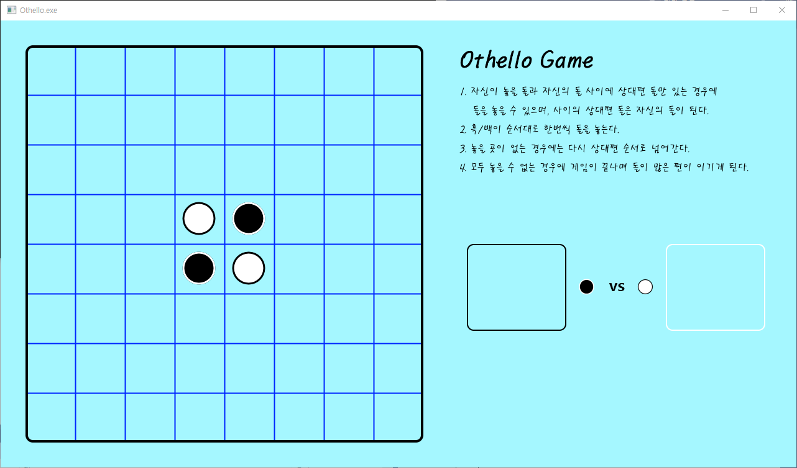
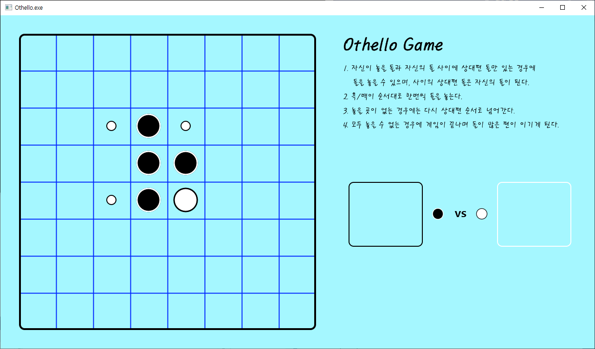
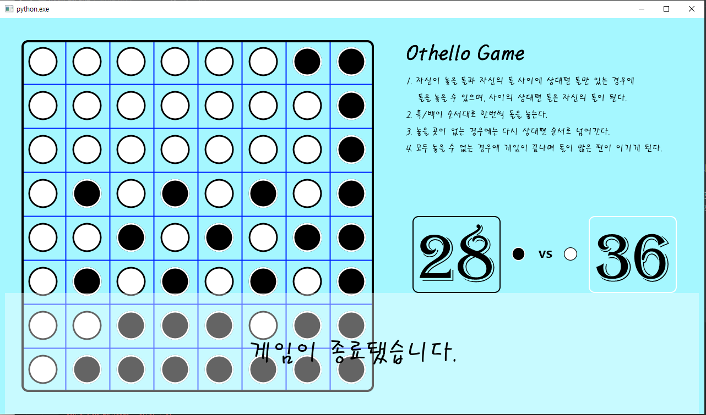

# 타워 디펜스

[Bangtal Library](https://cafe.naver.com/bangtal)를 활용한 오델로 게임입니다.

### 게임 규칙

- 컴퓨터를 상대로 보드 위에 자신이 돌을 더 많이 두면 승리하는 게임입니다.
- 플레이어는 검은 돌, 컴퓨터는 흰 돌로 플레이합니다.
- 각 턴마다 둘 수 있는 위치가 표시됩니다.
- 돌을 놓으면, 해당 위치와 자신의 돌 사이에 끼어있는 상대편의 모든 돌이 자신의 돌로 바뀝니다.
- 돌을 넣을 수 없는 경우 상대편 순서로 넘어갑니다.
- 모든 플레이어가 돌을 놓을 수 없는 상태가 되면 게임이 종료됩니다.
