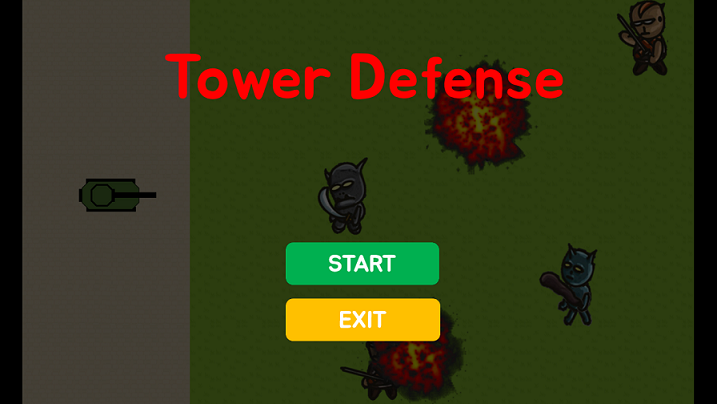
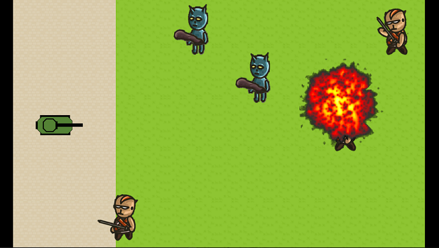
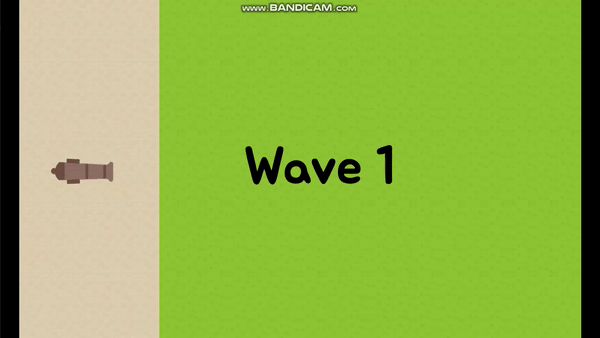
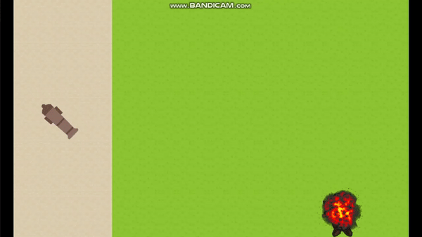
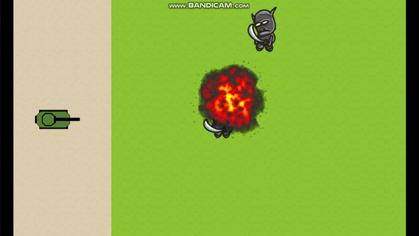

# 타워 디펜스

[Bangtal Library](https://cafe.naver.com/bangtal)를 활용한 타워 디펜스 게임입니다.

### 게임 규칙

- 각 Wave 마다 몰려오는 적들을 대포로 맞춰 물리쳐야 한다.
- Wave는 총 5 단계로 이루어지며, 갈수록 더 강한 적이 나타난다.
- 적들이 타워가 있는 경계선까지 오면 라이프가 줄어든다.
- 라이프가 0이 되면 게임이 끝나고, 더 강한 적일수록 라이프에 더 많은 피해를 입힌다.
- 아무 피해 없이 Wave 3 까지 도달하면 타워가 업그레이드 된다.

